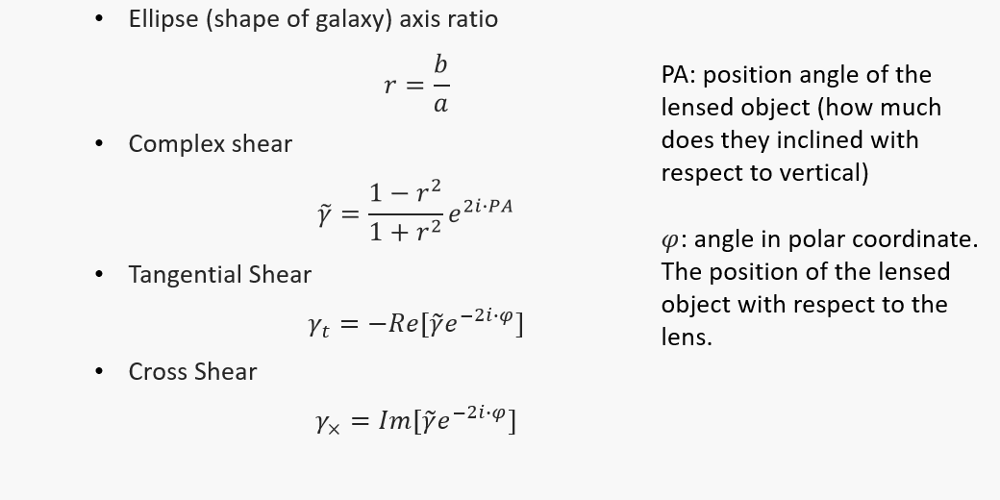

# VLA-tangential-shear-2018
Welcome to one of my very first project!
In this project, I explore **weak lensing**, especially tangential shear, with data from VLA(Very Large Array)!

- Supervisor: [Prof. Gilbert Holder](https://physics.illinois.edu/people/directory/profile/gholder) University of Illinois at Urbana-Champaign
- Data provider: [Eric Murphy](https://astronomy.as.virginia.edu/people/profile/ejm4v) NRAO National Radio Astronomy Observatory

# Theory
VLA catalog provides lists of galaxy with information about RA, DEC, semi-major axes, semi-minor axes,and position angle. With those information, I followed these basic equations:

