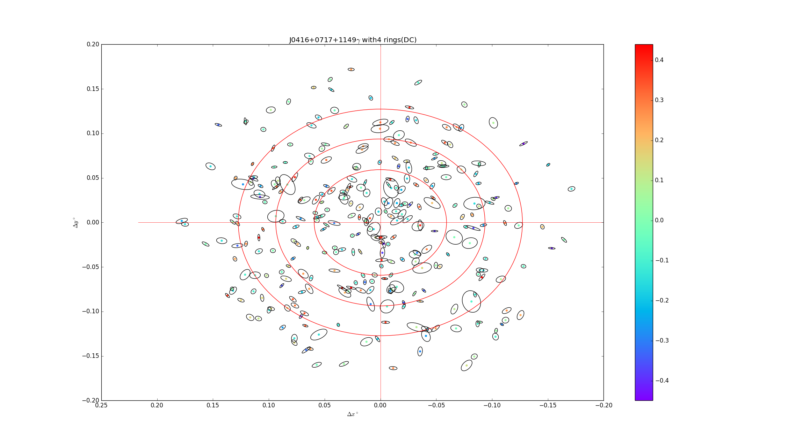
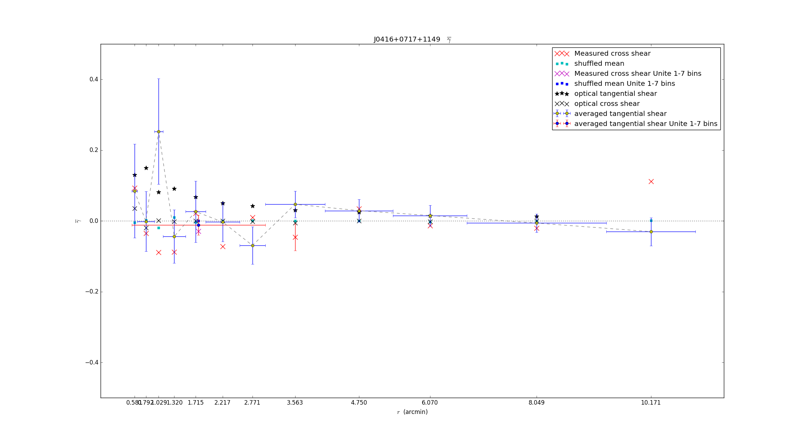
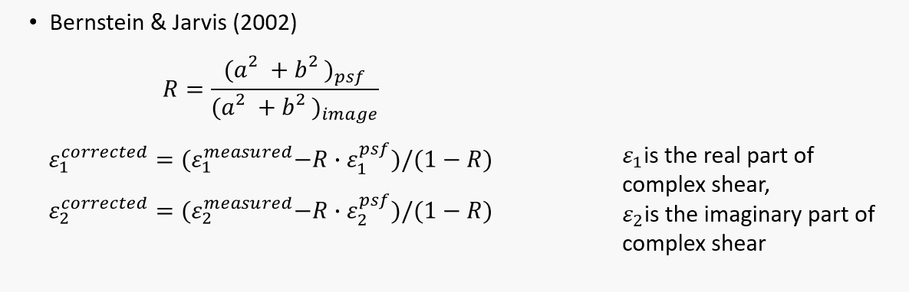
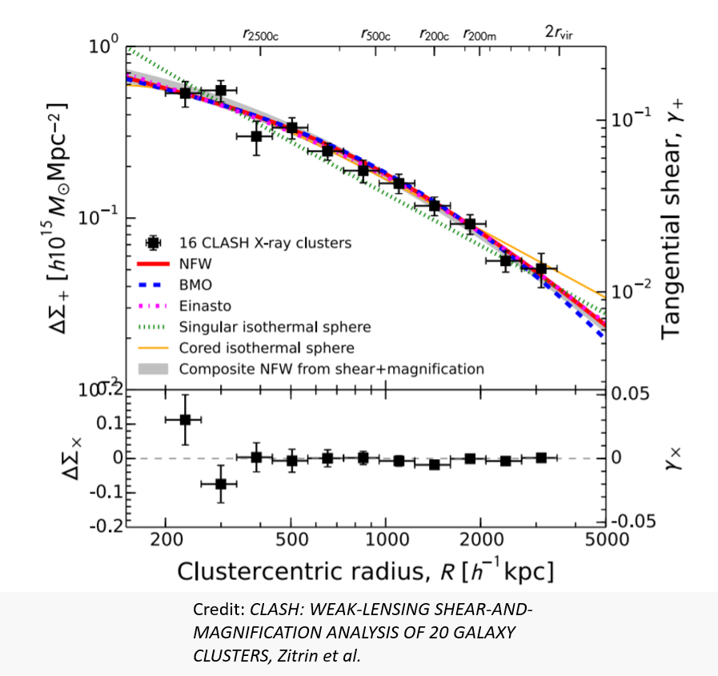

# VLA-tangential-shear-2018
Welcome to one of my very first project!
In this project, I explore **weak lensing**, especially tangential shear, with data from VLA(Very Large Array)!

- Supervisor: [Prof. Gilbert Holder](https://physics.illinois.edu/people/directory/profile/gholder) University of Illinois at Urbana-Champaign
- Data provider: [Eric Murphy](https://astronomy.as.virginia.edu/people/profile/ejm4v) NRAO National Radio Astronomy Observatory

**Note: The result is not clear enough to reach publishing quality!** Although the mean might work as a hint for the detection of tangential shear signal, the error bars are quite big. For the same reason, plots shown here might not be nicely polished. It's more like just an archive of what I did.

# Theory
(A brief introduction of gravitational lensing written by me can be found as Weak Gravitational Lensing_ZehaoJin.pptx in the repo.)
VLA catalog provides lists of galaxy with information about RA, DEC, semi-major axes, semi-minor axes,and position angle. With those information, we followed these basic equations:

One of the biggest challenge is the deconvolution of galaxy shape, we followed experts in weak lensing:

Another challenge is to cut out irrelevant/noisy galaxies:
- R cut: The quantity R pointed out by Bernstein and Jarvis(2002) implies how good an object is convoluted, so we placed an limit on R to cut out poorly convoluted objects.
- radio relic cut: cut out regions where found to be radio relics
- z cut: We mapped objects from VLA catalog to Subaru Telescope's data, so that I can retrive redshift information for matched galaxies. Then we cut out those galaxies which are in front of the lense. (i.e. cut galaxies with z< z of galaxy cluster)

# Results
We examined weaking lensing around galaxy cluster MACS J0416, MACS J0717, and MACS J1149. The following plot shows the scatter of galaxies in those clusters. Color bar indicates its tangential shear value, blue box indicates radio relics, and red rings are different bins in radius.
.png)
.png)
.png)
Re-center three galaxy clusters' cluster centers, and draw them on the same plot, we get the following image. Black circles indicates galaxy's shape and orientation.

We can obviously see that galaxies that are cross to cluster center(semi-major axis pointing towards center) gives blue, or low tangential shear value. Galaxies that are tangential to cluster center(semi-minor axis pointing towards center) gives red, or high tangential shear value.

In the end we calculated the average of tangential and cross shear value inside each radius bins(average inside each red rings). 

Error bars are obtained by shuffling VLA catalog's position and shape/orientation information. After this shuffle, galaxy's positoin and shape are no longer correlated, so theoriatially we shouldn't see any tangential shear. We perform this shuffle process for a large number of times, and calcuate each of their averaged tangential shear. We found the mean of shuffled averaged tangential shear is nearly zero, which is exactly what we expect, and then use their standard deviation as our error bar. This is a technique used a lot in lensing.

The "optical tangential shear" corresponds to published X-ray results of the 16 CLASH galaxy clusters(including 3 cluster we are interested in here) by Zitrin et al.

# Future
I think the reason why error bar is bigger than expected is
- These galaxies are highly elliptical(a/b ratio high). The shape we observe is intrinsic shape+gravitional lensing shape distortion, therefore such intrinsic shape of galaxies makes weak lensing shape distortion harder to detect. Although averaged a large number of galaxies should fix this problem(assuming galaxies are all oriented randomly), these intrinsic ellipticity will still slightly increase the standard deviation, plus we don't really have a large number of galaxies to average--see reason #2!
- VLA catalog turns out to be not that nicely convoluted, maybe because it's radio data. We had we cut out most of objects in the catalog in the end, which sounds scary! As a result, we don't have very large amount of objects(about 10~100 objects) in each radius bin.

This project can be improved in future with:
-more data: VLA Data from other galaxy clusters in addition to this 3 clusters
-better theory: Better way for deconvolution, and more sophisticated cuts applied to catalog.

